

  
Collection complète

  <h1>Catalogue</h1>

<form class="catalog-filters" data-catalog-filters>
  

    <label for="catalog-query">Rechercher</label>
    <input id="catalog-query" type="search" name="q" placeholder="Titre, lot, époque…" autocomplete="off">
  

  

    <label for="catalog-location">Localisation</label>
    <select id="catalog-location" name="location">
      <option value="">Toutes les pièces</option>
      <option value="Cheminée">Cheminée (1)</option>
<option value="Petite maison">Petite maison (1)</option>
<option value="À préciser">À préciser (82)</option>
    </select>
  

  

    <label for="catalog-category">Type d’objet</label>
    <select id="catalog-category" name="category">
      <option value="">Tous les types</option>
      <option value="Accessoire de cheminée">Accessoire de cheminée (1)</option>
<option value="Accessoire de maison">Accessoire de maison (2)</option>
<option value="Applique">Applique (1)</option>
<option value="Armoire">Armoire (1)</option>
<option value="Arts de la table">Arts de la table (2)</option>
<option value="Bibliothèque">Bibliothèque (2)</option>
<option value="Candélabre">Candélabre (2)</option>
<option value="Chauffage">Chauffage (2)</option>
<option value="Cuisinière">Cuisinière (1)</option>
<option value="Céramique">Céramique (2)</option>
<option value="Décoration murale">Décoration murale (1)</option>
<option value="Encrier">Encrier (1)</option>
<option value="Horlogerie">Horlogerie (1)</option>
<option value="Instrument de musique">Instrument de musique (1)</option>
<option value="Lampadaire">Lampadaire (1)</option>
<option value="Lampe">Lampe (1)</option>
<option value="Lanterne">Lanterne (2)</option>
<option value="Lit">Lit (2)</option>
<option value="Luminaire">Luminaire (15)</option>
<option value="Luminaire et horlogerie">Luminaire et horlogerie (1)</option>
<option value="Madia">Madia (1)</option>
<option value="Meuble de classement">Meuble de classement (1)</option>
<option value="Meuble de métier">Meuble de métier (1)</option>
<option value="Meuble de rangement">Meuble de rangement (10)</option>
<option value="Meuble de toilette">Meuble de toilette (1)</option>
<option value="Meuble à épices">Meuble à épices (1)</option>
<option value="Miroir">Miroir (3)</option>
<option value="Mobilier de toilette">Mobilier de toilette (2)</option>
<option value="Objet de fumeur">Objet de fumeur (1)</option>
<option value="Objet technique">Objet technique (1)</option>
<option value="Pendule">Pendule (1)</option>
<option value="Placard mural">Placard mural (1)</option>
<option value="Siège">Siège (4)</option>
<option value="Siège enfant">Siège enfant (1)</option>
<option value="Table">Table (2)</option>
<option value="Table d&#x27;appoint">Table d&#x27;appoint (1)</option>
<option value="Table de chevet">Table de chevet (1)</option>
<option value="Table de toilette">Table de toilette (1)</option>
<option value="Travailleuse">Travailleuse (1)</option>
<option value="Vase">Vase (1)</option>
<option value="Vitrine">Vitrine (1)</option>
<option value="Éléments décoratifs">Éléments décoratifs (1)</option>
<option value="Équipement audio">Équipement audio (3)</option>
<option value="Équipement sportif">Équipement sportif (1)</option>
    </select>
  

  <button class="catalog-reset" type="reset">Réinitialiser</button>
  
<strong data-result-count>84</strong> lots affichés

</form>

<article class="catalog-card" data-location="Petite maison" data-category="Lit"><a href="MOB-001/">

Lot MOB-001Lit
<h2>Lit italien en fer peint et incrustations de nacre</h2>
Vers 1850-1880

Estimation<strong>400 € – 700 €</strong>

</a></article><article class="catalog-card" data-location="À préciser" data-category="Pendule"><a href="MOB-002/">

Lot MOB-002Pendule
<h2>Pendule Art déco aux deux lévriers</h2>
Vers 1925-1935

Estimation<strong>120 € – 250 €</strong>

</a></article><article class="catalog-card" data-location="À préciser" data-category="Lanterne"><a href="MOB-003/">

Lot MOB-003Lanterne
<h2>Lanterne-tempête en tôle noire</h2>
Première moitié du XXe siècle

Estimation<strong>25 € – 60 €</strong>

</a></article><article class="catalog-card" data-location="À préciser" data-category="Lanterne"><a href="MOB-004/">

Lot MOB-004Lanterne
<h2>Lanterne de voiture ou de fiacre</h2>
Vers 1890-1920

Estimation<strong>50 € – 100 €</strong>

</a></article><article class="catalog-card" data-location="À préciser" data-category="Équipement sportif"><a href="MOB-005/">

Lot MOB-005Équipement sportif
<h2>Raquette de tennis Persenico « Derby » avec presse</h2>
Années 1950

Estimation<strong>40 € – 70 €</strong>

</a></article><article class="catalog-card" data-location="À préciser" data-category="Accessoire de cheminée"><a href="MOB-006/">

Lot MOB-006Accessoire de cheminée
<h2>Tournebroche mécanique de cheminée FUF</h2>
Fin du XIXe ou première moitié du XXe siècle

Estimation<strong>80 € – 180 €</strong>

</a></article><article class="catalog-card" data-location="À préciser" data-category="Luminaire"><a href="MOB-007/">

Lot MOB-007Luminaire
<h2>Lustre Art nouveau à quatre lumières et franges de verre</h2>
Vers 1900-1915

Estimation<strong>300 € – 650 €</strong>

</a></article><article class="catalog-card" data-location="À préciser" data-category="Luminaire"><a href="MOB-008/">

Lot MOB-008Luminaire
<h2>Lustre Art déco à trois bras et cascade de verre</h2>
Vers 1925-1935

Estimation<strong>200 € – 450 €</strong>

</a></article><article class="catalog-card" data-location="À préciser" data-category="Luminaire"><a href="MOB-009/">

Lot MOB-009Luminaire
<h2>Grand lustre à pétrole électrifié, quatre bras à opalines</h2>
Fin du XIXe - début du XXe siècle

Estimation<strong>180 € – 400 €</strong>

</a></article><article class="catalog-card" data-location="À préciser" data-category="Table"><a href="MOB-010/">

Lot MOB-010Table
<h2>Table ronde Art déco à pied central</h2>
Vers 1925-1940

Estimation<strong>350 € – 700 €</strong>

</a></article><article class="catalog-card" data-location="À préciser" data-category="Lampe"><a href="MOB-011/">

Lot MOB-011Lampe
<h2>Lampe japonisante au héron sur une tortue minogame</h2>
Fin du XIXe - début du XXe siècle

Estimation<strong>250 € – 600 €</strong>

</a></article><article class="catalog-card" data-location="À préciser" data-category="Table de chevet"><a href="MOB-012/">

Lot MOB-012Table de chevet
<h2>Table de chevet Art déco à décor de nacre</h2>
Vers 1925-1940

Estimation<strong>300 € – 650 €</strong>

</a></article><article class="catalog-card" data-location="À préciser" data-category="Décoration murale"><a href="MOB-013/">

Lot MOB-013Décoration murale
<h2>Composition murale de fruits et feuillages en relief</h2>
Milieu du XXe siècle

Estimation<strong>30 € – 80 €</strong>

</a></article><article class="catalog-card" data-location="À préciser" data-category="Meuble à épices"><a href="MOB-014/">

Lot MOB-014Meuble à épices
<h2>Petit meuble mural à huit tiroirs pour épices</h2>
Vers 1900-1930

Estimation<strong>80 € – 160 €</strong>

</a></article><article class="catalog-card" data-location="À préciser" data-category="Cuisinière"><a href="MOB-015/">

Lot MOB-015Cuisinière
<h2>Cuisinière économique émaillée ERMEC</h2>
Vers 1940-1960

Estimation<strong>80 € – 200 €</strong>

</a></article><article class="catalog-card" data-location="À préciser" data-category="Céramique"><a href="MOB-016/">

Lot MOB-016Céramique
<h2>Grand plat rond italien à décor floral polychrome</h2>
Seconde moitié du XXe siècle

Estimation<strong>30 € – 80 €</strong>

</a></article><article class="catalog-card" data-location="À préciser" data-category="Placard mural"><a href="MOB-017/">

Lot MOB-017Placard mural
<h2>Placard mural rustique à deux portes vitrées</h2>
Fin du XIXe - début du XXe siècle

Estimation<strong>150 € – 350 €</strong>

</a></article><article class="catalog-card" data-location="À préciser" data-category="Candélabre"><a href="MOB-018/">

Lot MOB-018Candélabre
<h2>Paire de candélabres à cinq lumières en métal doré</h2>
Première moitié du XXe siècle · 2 items

Estimation<strong>120 € – 280 €</strong>

</a></article><article class="catalog-card" data-location="À préciser" data-category="Candélabre"><a href="MOB-019/">

Lot MOB-019Candélabre
<h2>Candélabre à deux lumières au décor de grappe de raisin</h2>
Vers 1930-1960

Estimation<strong>40 € – 90 €</strong>

</a></article><article class="catalog-card" data-location="À préciser" data-category="Céramique"><a href="MOB-020/">

Lot MOB-020Céramique
<h2>Corbeille de cerises en céramique de Deruta</h2>
Vers 1960-1980

Estimation<strong>40 € – 100 €</strong>

</a></article><article class="catalog-card" data-location="À préciser" data-category="Madia"><a href="MOB-021/">

Lot MOB-021Madia
<h2>Madia toscane à pétrin, deux tiroirs et deux portes</h2>
Fin du XIXe - début du XXe siècle

Estimation<strong>250 € – 500 €</strong>

</a></article><article class="catalog-card" data-location="À préciser" data-category="Meuble de métier"><a href="MOB-022/">

Lot MOB-022Meuble de métier
<h2>Grand meuble de métier vitré à nombreux casiers</h2>
Vers 1900-1930

Estimation<strong>1 000 € – 2 200 €</strong>

</a></article><article class="catalog-card" data-location="À préciser" data-category="Vase"><a href="MOB-023/">

Lot MOB-023Vase
<h2>Grand vase soliflore en verre transparent côtelé</h2>
Première moitié ou milieu du XXe siècle

Estimation<strong>40 € – 100 €</strong>

</a></article><article class="catalog-card" data-location="À préciser" data-category="Travailleuse"><a href="MOB-024/">

Lot MOB-024Travailleuse
<h2>Travailleuse en bois sur piètement à compartiments déployants</h2>
Vers 1950-1970

Estimation<strong>80 € – 180 €</strong>

</a></article><article class="catalog-card" data-location="À préciser" data-category="Équipement audio"><a href="MOB-025/">

Lot MOB-025Équipement audio
<h2>Ensemble d’enceintes Sony SRS-150 et petits moniteurs associés</h2>
Années 1980 · 4 items

Estimation<strong>400 € – 880 €</strong>

</a></article><article class="catalog-card" data-location="À préciser" data-category="Encrier"><a href="MOB-026/">

Lot MOB-026Encrier
<h2>Encrier de bureau Art déco en métal patiné et marbre</h2>
Vers 1925-1940

Estimation<strong>60 € – 150 €</strong>

</a></article><article class="catalog-card" data-location="À préciser" data-category="Luminaire"><a href="MOB-027/">

Lot MOB-027Luminaire
<h2>Suspension à vasque festonnée en verre opalin moulé</h2>
Vers 1930-1960

Estimation<strong>60 € – 140 €</strong>

</a></article><article class="catalog-card" data-location="À préciser" data-category="Miroir"><a href="MOB-028/">

Lot MOB-028Miroir
<h2>Miroir mural octogonal à cadre en bois</h2>
Vers 1930-1960

Estimation<strong>40 € – 100 €</strong>

</a></article><article class="catalog-card" data-location="À préciser" data-category="Siège enfant"><a href="MOB-029/">

Lot MOB-029Siège enfant
<h2>Seggiolone rustique en bois à assise paillée</h2>
Fin du XIXe - première moitié du XXe siècle

Estimation<strong>70 € – 180 €</strong>

</a></article><article class="catalog-card" data-location="À préciser" data-category="Équipement audio"><a href="MOB-030/">

Lot MOB-030Équipement audio
<h2>Lecteur de CD compact Sony D-50 / D-5</h2>
1984-1985

Estimation<strong>120 € – 280 €</strong>

</a></article><article class="catalog-card" data-location="À préciser" data-category="Objet de fumeur"><a href="MOB-031/">

Lot MOB-031Objet de fumeur
<h2>Coffret Dunhill London contenant trois pipes en bruyère</h2>
Milieu du XXe siècle · 3 items

Estimation<strong>450 € – 1 350 €</strong>

</a></article><article class="catalog-card" data-location="À préciser" data-category="Chauffage"><a href="MOB-032/">

Lot MOB-032Chauffage
<h2>Chauffage mobile à gaz Campingaz 5000 IR</h2>
Vers 1990-2010

Estimation<strong>30 € – 80 €</strong>

</a></article><article class="catalog-card" data-location="À préciser" data-category="Lampadaire"><a href="MOB-033/">

Lot MOB-033Lampadaire
<h2>Lampadaire historiciste à trois lumières et base aux lièvres</h2>
Fin du XIXe - première moitié du XXe siècle

Estimation<strong>250 € – 600 €</strong>

</a></article><article class="catalog-card" data-location="À préciser" data-category="Bibliothèque"><a href="MOB-034/">

Lot MOB-034Bibliothèque
<h2>Bibliothèque vitrée étroite à deux portes et un tiroir</h2>
Fin du XIXe - début du XXe siècle

Estimation<strong>300 € – 700 €</strong>

</a></article><article class="catalog-card" data-location="À préciser" data-category="Meuble de toilette"><a href="MOB-035/">

Lot MOB-035Meuble de toilette
<h2>Meuble de toilette Art nouveau à miroir et vitres vertes</h2>
Vers 1900-1920

Estimation<strong>250 € – 600 €</strong>

</a></article><article class="catalog-card" data-location="À préciser" data-category="Table de toilette"><a href="MOB-036/">

Lot MOB-036Table de toilette
<h2>Petite table de toilette à deux abattants</h2>
Fin du XIXe - première moitié du XXe siècle

Estimation<strong>100 € – 250 €</strong>

</a></article><article class="catalog-card" data-location="À préciser" data-category="Applique"><a href="MOB-037/">

Lot MOB-037Applique
<h2>Applique florale en tôle peinte</h2>
Vers 1940-1960

Estimation<strong>60 € – 150 €</strong>

</a></article><article class="catalog-card" data-location="À préciser" data-category="Miroir"><a href="MOB-038/">

Lot MOB-038Miroir
<h2>Miroir de salle de bain Art déco avec tablette et porte-serviette</h2>
Vers 1930-1950

Estimation<strong>80 € – 180 €</strong>

</a></article><article class="catalog-card" data-location="À préciser" data-category="Éléments décoratifs"><a href="MOB-039/">

Lot MOB-039Éléments décoratifs
<h2>Lot d’ornements floraux et fruitiers sur tiges métalliques</h2>
Milieu du XXe siècle · 3 items

Estimation<strong>90 € – 300 €</strong>

</a></article><article class="catalog-card" data-location="À préciser" data-category="Armoire"><a href="MOB-040/">

Lot MOB-040Armoire
<h2>Grande armoire Art déco en ronce de noyer, miroir et nacre</h2>
Vers 1925-1940

Estimation<strong>900 € – 2 200 €</strong>

</a></article><article class="catalog-card" data-location="À préciser" data-category="Meuble de classement"><a href="MOB-041/">

Lot MOB-041Meuble de classement
<h2>Meuble-classeur vertical à sept abattants</h2>
Vers 1900-1930

Estimation<strong>250 € – 600 €</strong>

</a></article><article class="catalog-card" data-location="À préciser" data-category="Bibliothèque"><a href="MOB-042/">

Lot MOB-042Bibliothèque
<h2>Bibliothèque-vitrine large à portes de verre vert</h2>
Vers 1900-1930

Estimation<strong>300 € – 700 €</strong>

</a></article><article class="catalog-card" data-location="À préciser" data-category="Vitrine"><a href="MOB-043/">

Lot MOB-043Vitrine
<h2>Vitrine étroite à une porte de verre vert</h2>
Vers 1900-1930

Estimation<strong>150 € – 350 €</strong>

</a></article><article class="catalog-card" data-location="À préciser" data-category="Équipement audio"><a href="MOB-044/">

Lot MOB-044Équipement audio
<h2>Paire d’enceintes JVC SP-UX2000RGD</h2>
Vers 1997-2000 · 2 items

Estimation<strong>100 € – 240 €</strong>

</a></article><article class="catalog-card" data-location="Cheminée" data-category="Chauffage"><a href="MOB-045/">

Lot MOB-045Chauffage
<h2>Calorifère portatif à pétrole à réflecteur</h2>
Vers 1900-1920

Estimation<strong>50 € – 120 €</strong>

</a></article><article class="catalog-card" data-location="À préciser" data-category="Meuble de rangement"><a href="MOB-046/">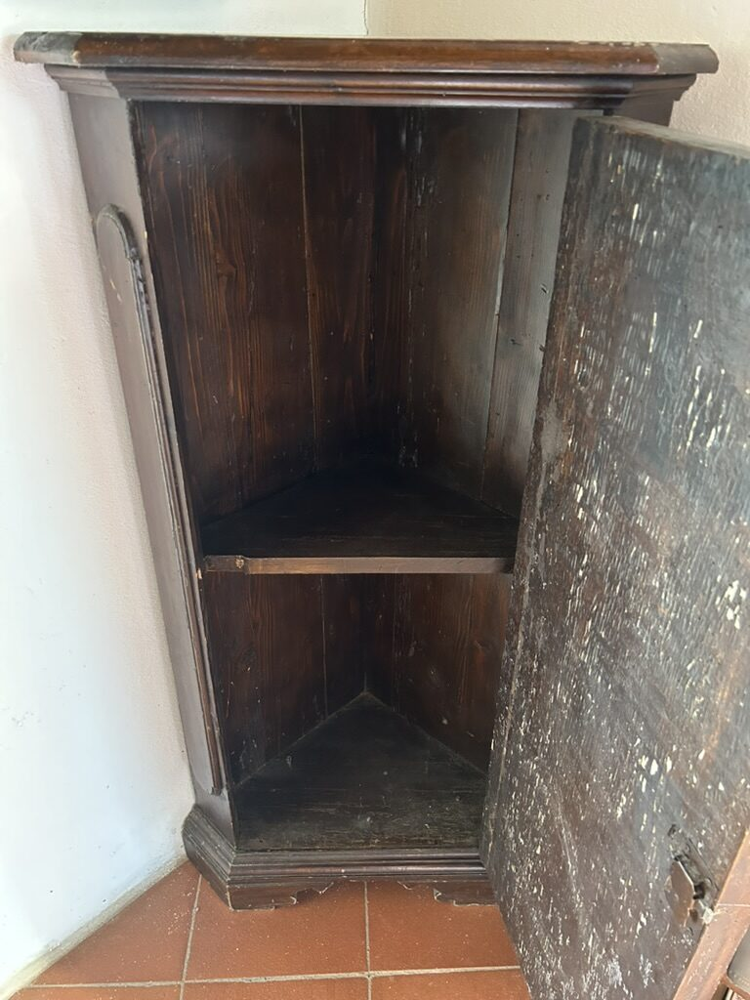

Lot MOB-046Meuble de rangement
<h2>Encoignure à une porte</h2>
Fin XVIIIe–début XIXe siècle

Estimation<strong>150 € – 300 €</strong>

</a></article><article class="catalog-card" data-location="À préciser" data-category="Luminaire"><a href="MOB-047/">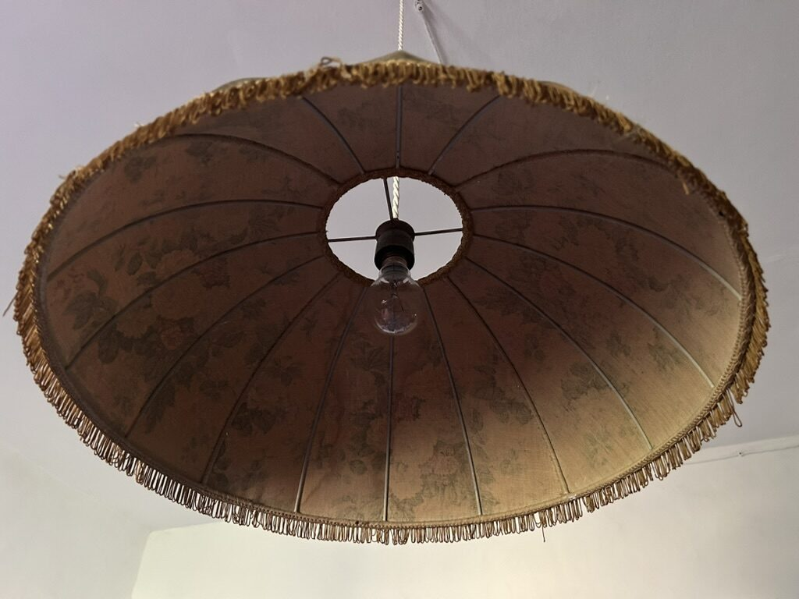

Lot MOB-047Luminaire
<h2>Suspension à grand abat-jour textile fleuri</h2>
Vers 1930–1950

Estimation<strong>40 € – 100 €</strong>

</a></article><article class="catalog-card" data-location="À préciser" data-category="Luminaire"><a href="MOB-048/">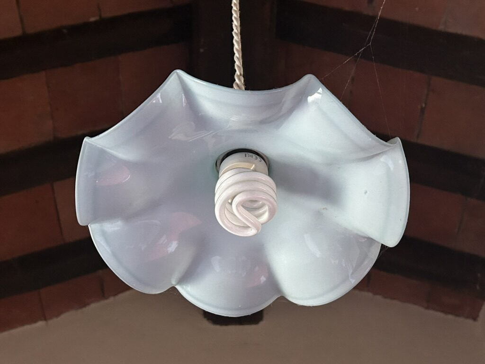

Lot MOB-048Luminaire
<h2>Suspension à vasque en verre opalin bleu pâle</h2>
Vers 1930–1950

Estimation<strong>40 € – 90 €</strong>

</a></article><article class="catalog-card" data-location="À préciser" data-category="Luminaire"><a href="MOB-049/">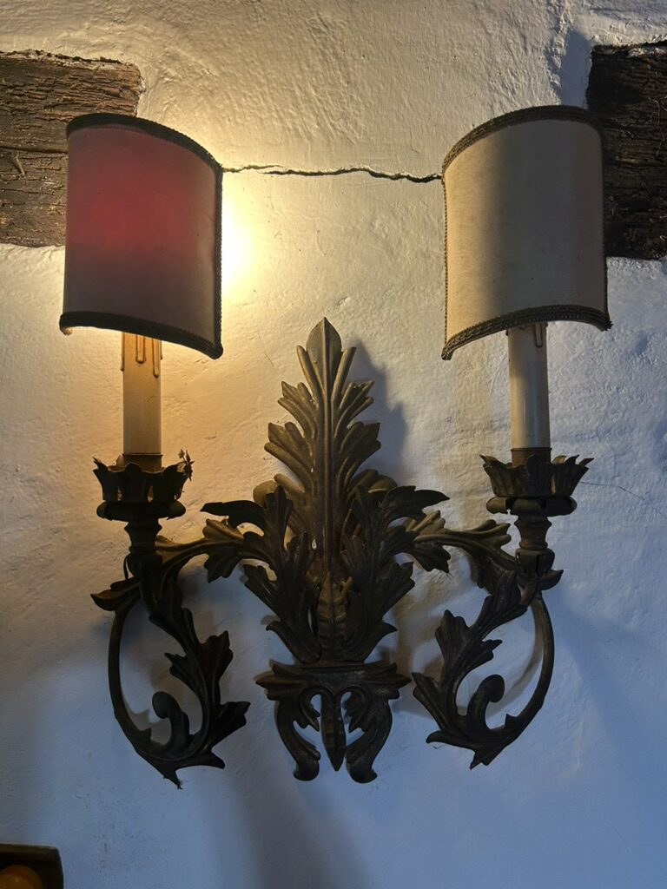

Lot MOB-049Luminaire
<h2>Applique à deux lumières aux feuilles d&#x27;acanthe</h2>
Vers 1900–1930

Estimation<strong>80 € – 180 €</strong>

</a></article><article class="catalog-card" data-location="À préciser" data-category="Luminaire"><a href="MOB-050/">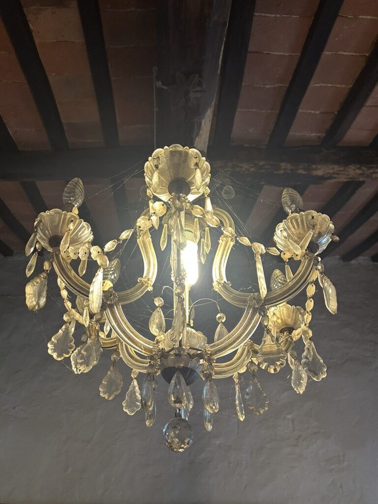

Lot MOB-050Luminaire
<h2>Lustre à pendeloques de verre</h2>
Vers 1940–1960

Estimation<strong>150 € – 350 €</strong>

</a></article><article class="catalog-card" data-location="À préciser" data-category="Luminaire"><a href="MOB-051/">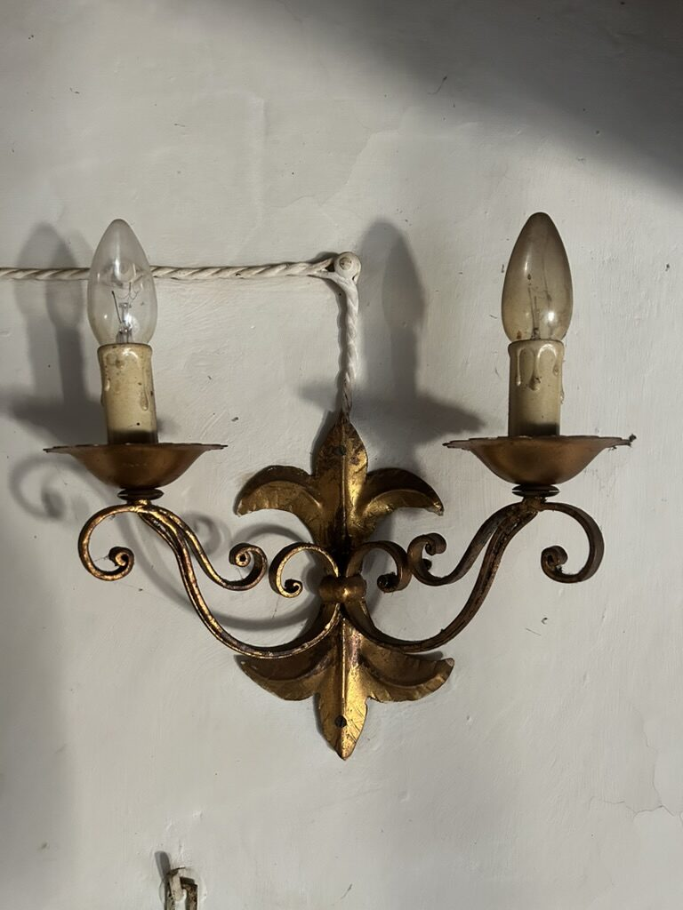

Lot MOB-051Luminaire
<h2>Applique à deux lumières au motif de fleur de lys</h2>
Vers 1940–1960

Estimation<strong>40 € – 90 €</strong>

</a></article><article class="catalog-card" data-location="À préciser" data-category="Luminaire"><a href="MOB-052/">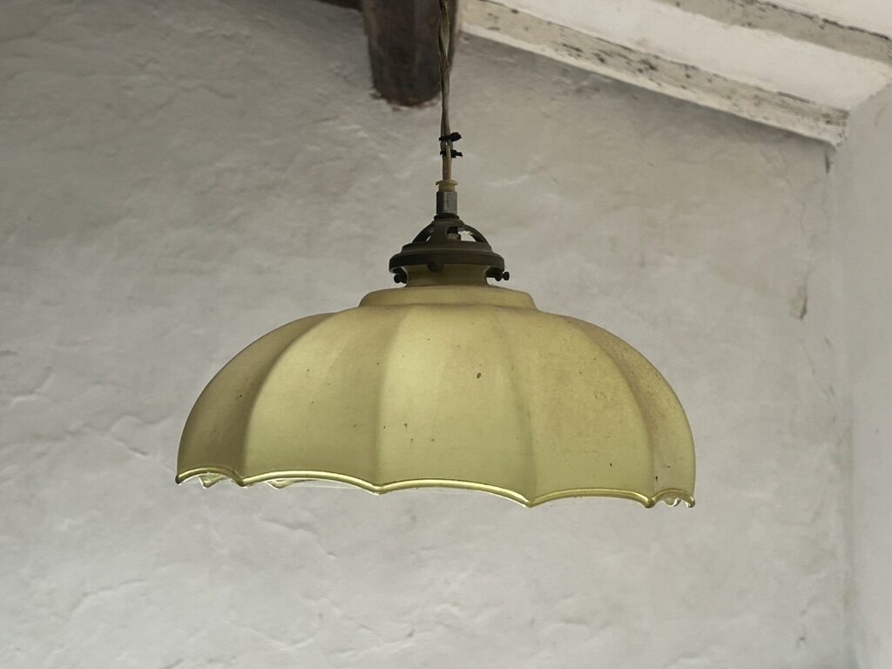

Lot MOB-052Luminaire
<h2>Suspension à vasque festonnée jaune pâle</h2>
Vers 1930–1950

Estimation<strong>50 € – 120 €</strong>

</a></article><article class="catalog-card" data-location="À préciser" data-category="Meuble de rangement"><a href="MOB-053/">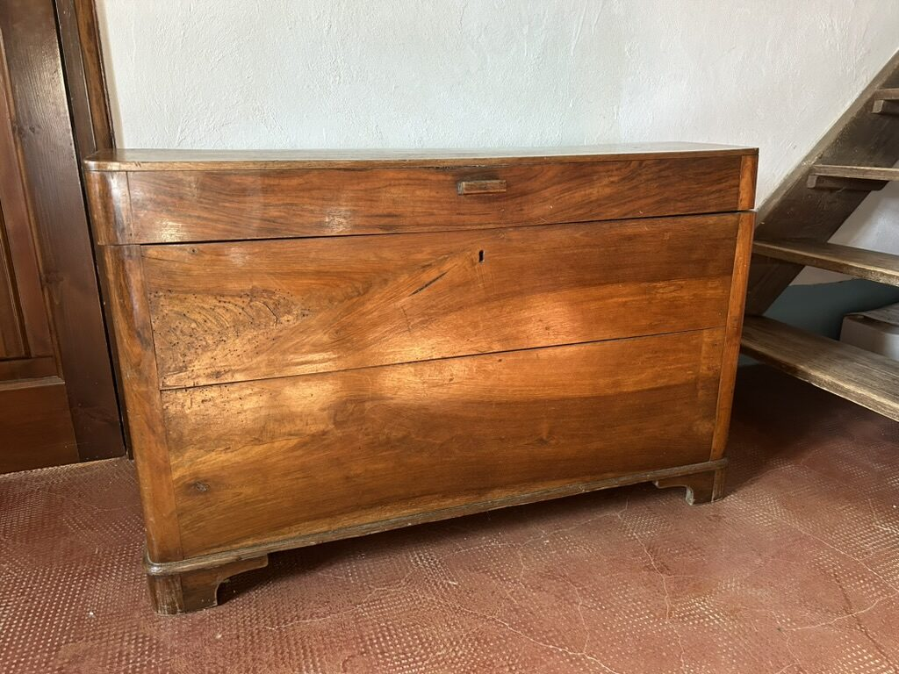

Lot MOB-053Meuble de rangement
<h2>Coffre en bois à façade panneautée</h2>
XIXe siècle

Estimation<strong>100 € – 250 €</strong>

</a></article><article class="catalog-card" data-location="À préciser" data-category="Mobilier de toilette"><a href="MOB-054/">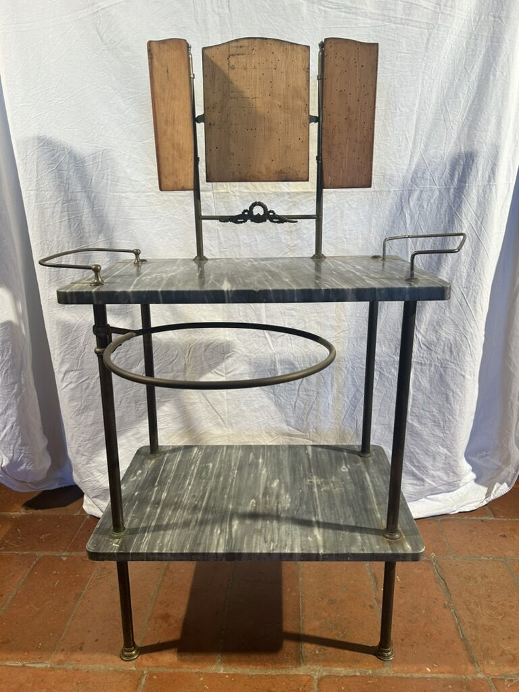

Lot MOB-054Mobilier de toilette
<h2>Meuble de toilette à dessus de marbre et miroir triptyque</h2>
Vers 1900–1930

Estimation<strong>200 € – 450 €</strong>

</a></article><article class="catalog-card" data-location="À préciser" data-category="Table d&#x27;appoint"><a href="MOB-055/">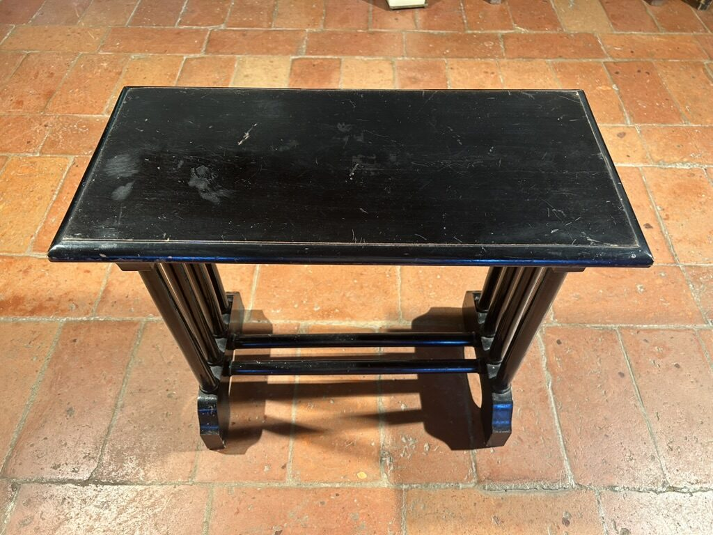

Lot MOB-055Table d&#x27;appoint
<h2>Petite table noire à piètement cannelé</h2>
Fin XIXe–début XXe siècle

Estimation<strong>80 € – 180 €</strong>

</a></article><article class="catalog-card" data-location="À préciser" data-category="Siège"><a href="MOB-056/">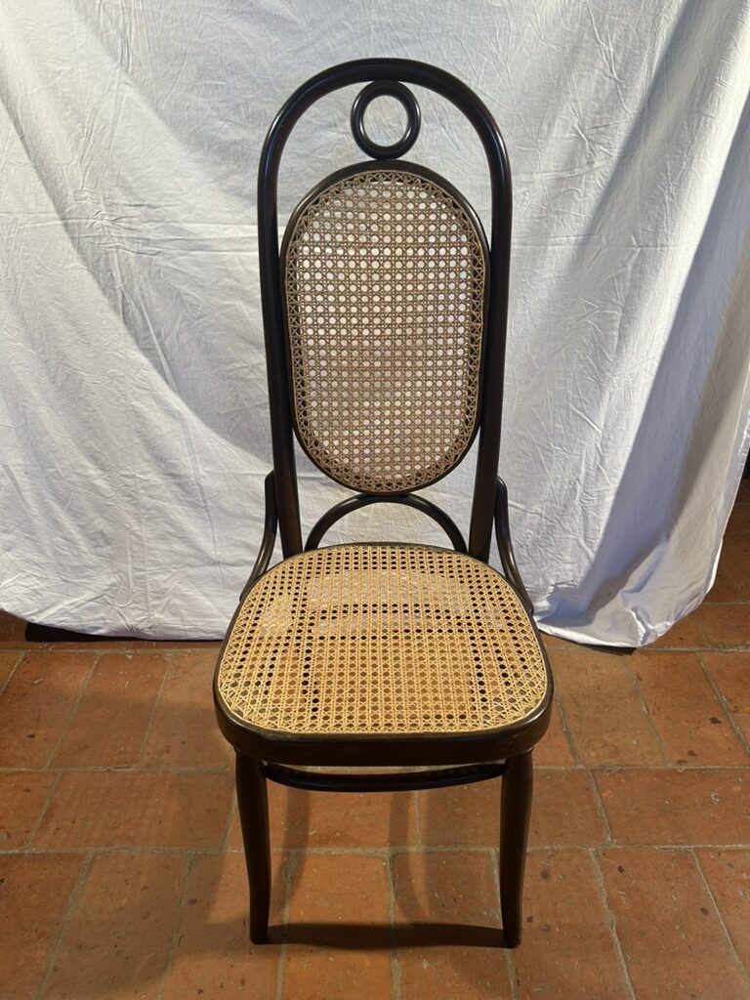

Lot MOB-056Siège
<h2>Chaise en bois courbé et cannage</h2>
Vers 1900–1930

Estimation<strong>80 € – 160 €</strong>

</a></article><article class="catalog-card" data-location="À préciser" data-category="Siège"><a href="MOB-057/">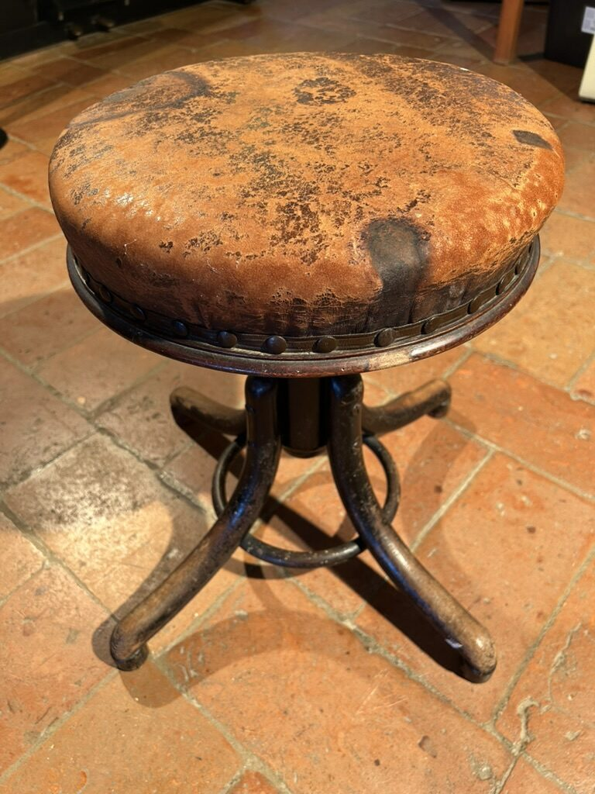

Lot MOB-057Siège
<h2>Tabouret de piano pivotant</h2>
Vers 1890–1920

Estimation<strong>60 € – 140 €</strong>

</a></article><article class="catalog-card" data-location="À préciser" data-category="Siège"><a href="MOB-058/">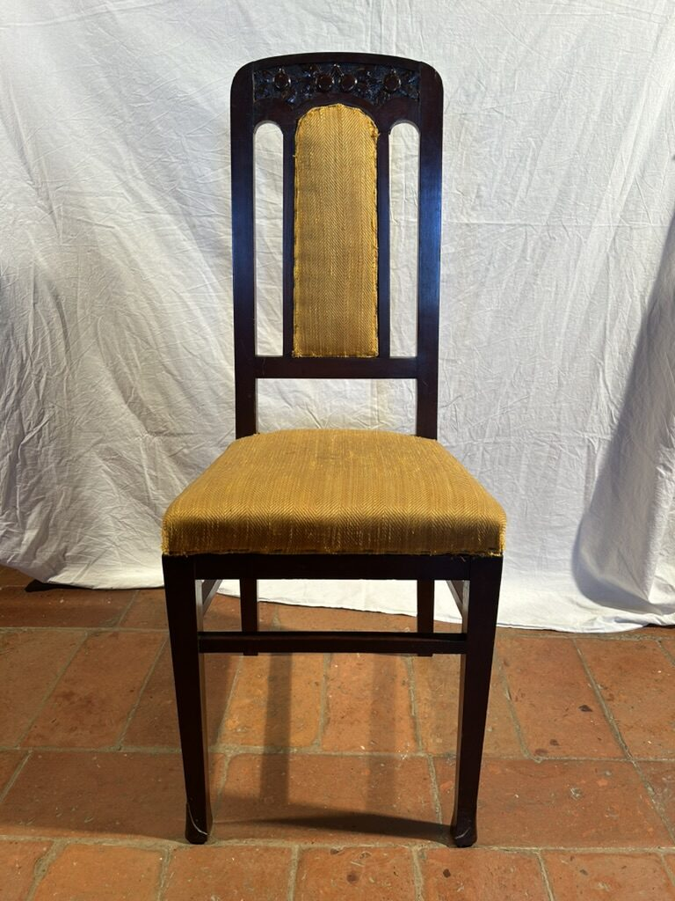

Lot MOB-058Siège
<h2>Chaise à dossier sculpté et garniture jaune</h2>
Vers 1910–1930

Estimation<strong>80 € – 160 €</strong>

</a></article><article class="catalog-card" data-location="À préciser" data-category="Meuble de rangement"><a href="MOB-059/">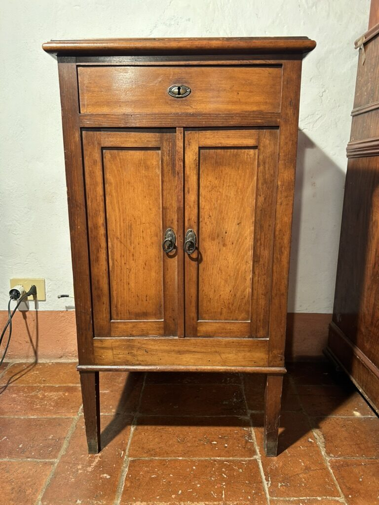

Lot MOB-059Meuble de rangement
<h2>Petit meuble haut à deux portes et un tiroir</h2>
Début XXe siècle

Estimation<strong>80 € – 180 €</strong>

</a></article><article class="catalog-card" data-location="À préciser" data-category="Table"><a href="MOB-060/">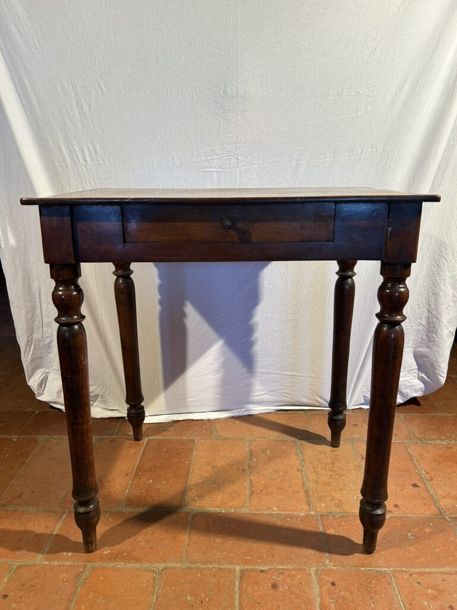

Lot MOB-060Table
<h2>Table rectangulaire à quatre pieds tournés</h2>
Fin XIXe–début XXe siècle

Estimation<strong>120 € – 250 €</strong>

</a></article><article class="catalog-card" data-location="À préciser" data-category="Objet technique"><a href="MOB-061/">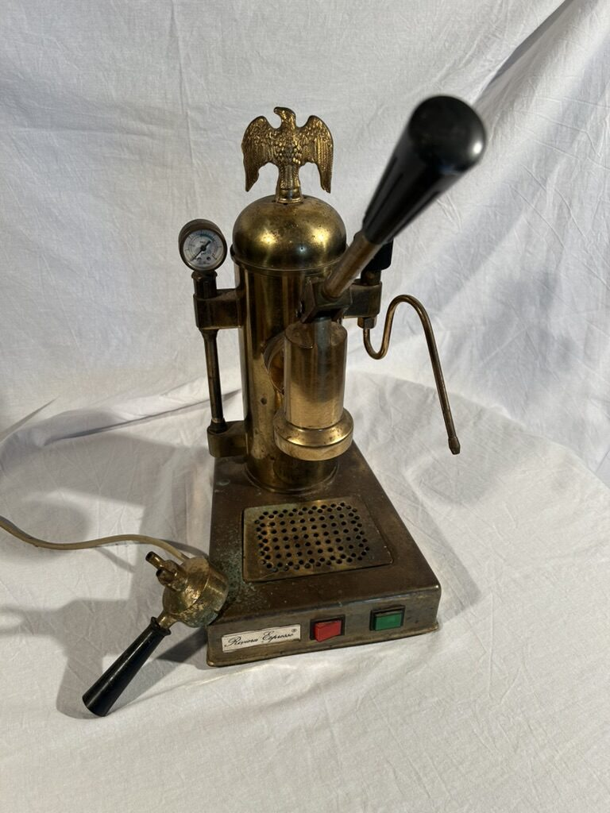

Lot MOB-061Objet technique
<h2>Machine à expresso à levier Riviera Espresso</h2>
Vers 1970–1990

Estimation<strong>80 € – 180 €</strong>

</a></article><article class="catalog-card" data-location="À préciser" data-category="Luminaire et horlogerie"><a href="MOB-062/">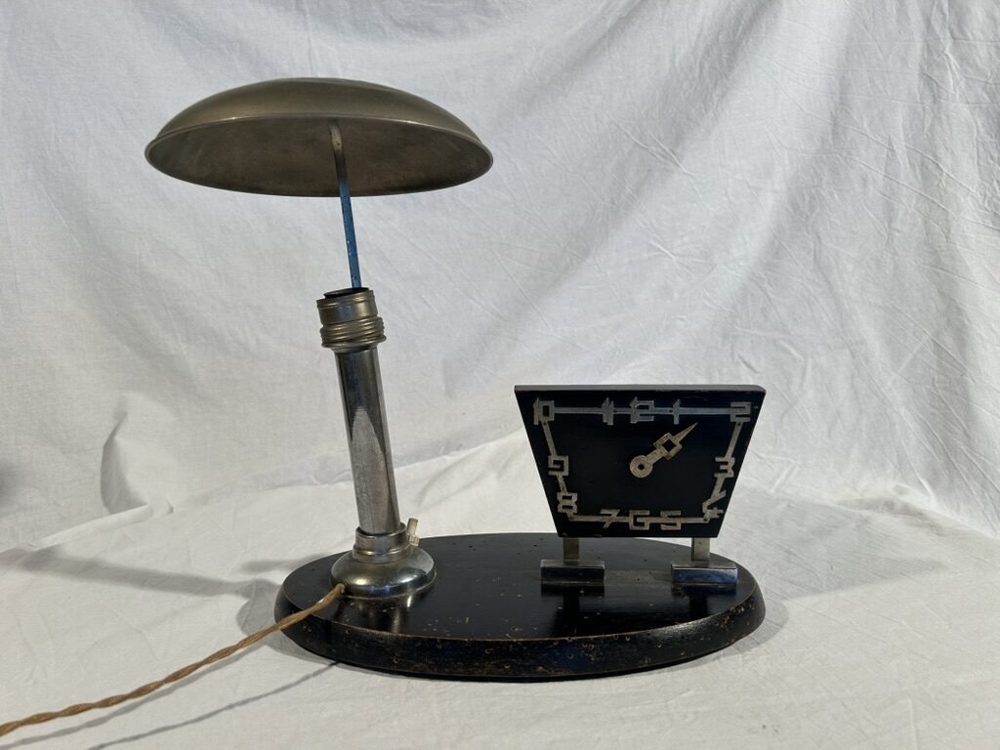

Lot MOB-062Luminaire et horlogerie
<h2>Lampe de bureau Art déco avec pendulette</h2>
Vers 1930–1940

Estimation<strong>100 € – 250 €</strong>

</a></article><article class="catalog-card" data-location="À préciser" data-category="Luminaire"><a href="MOB-063/">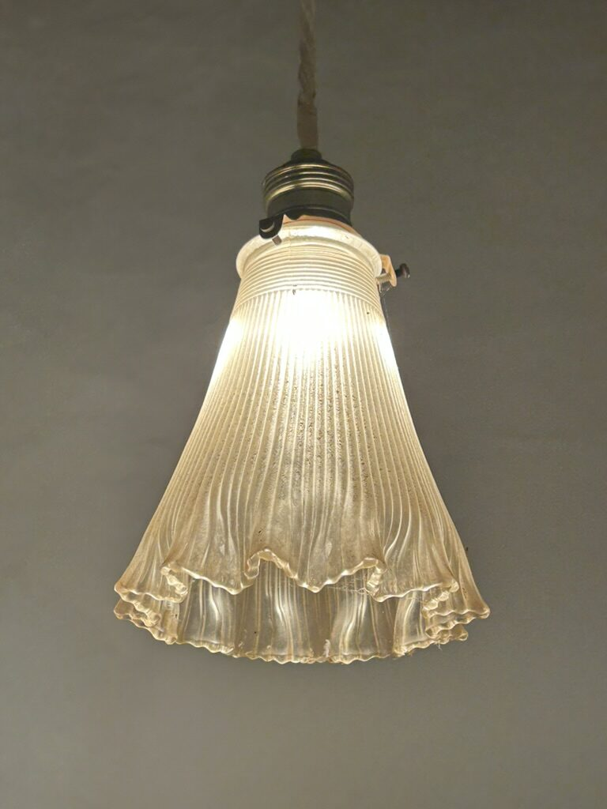

Lot MOB-063Luminaire
<h2>Suspension en verre moulé plissé</h2>
Vers 1920–1940

Estimation<strong>30 € – 70 €</strong>

</a></article><article class="catalog-card" data-location="À préciser" data-category="Luminaire"><a href="MOB-064/">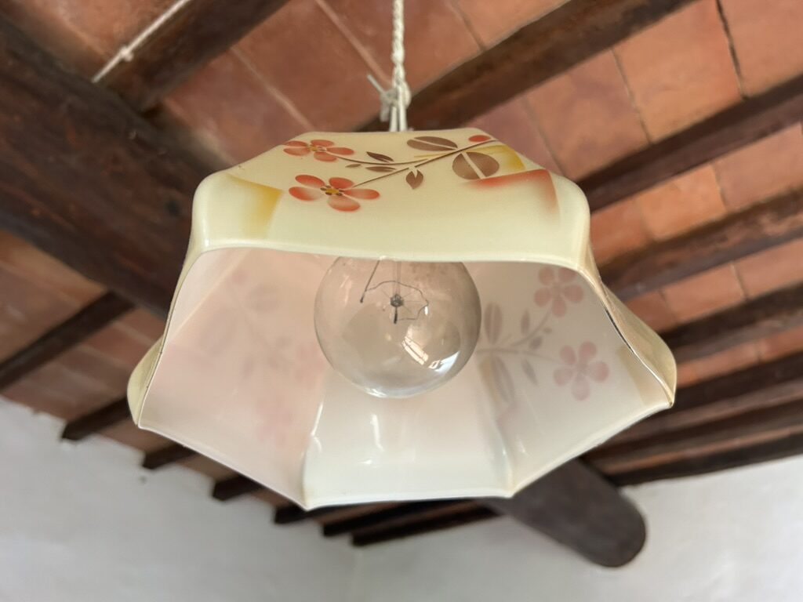

Lot MOB-064Luminaire
<h2>Suspension en verre opalin à décor floral orangé</h2>
Vers 1930–1950

Estimation<strong>50 € – 100 €</strong>

</a></article><article class="catalog-card" data-location="À préciser" data-category="Accessoire de maison"><a href="MOB-065/">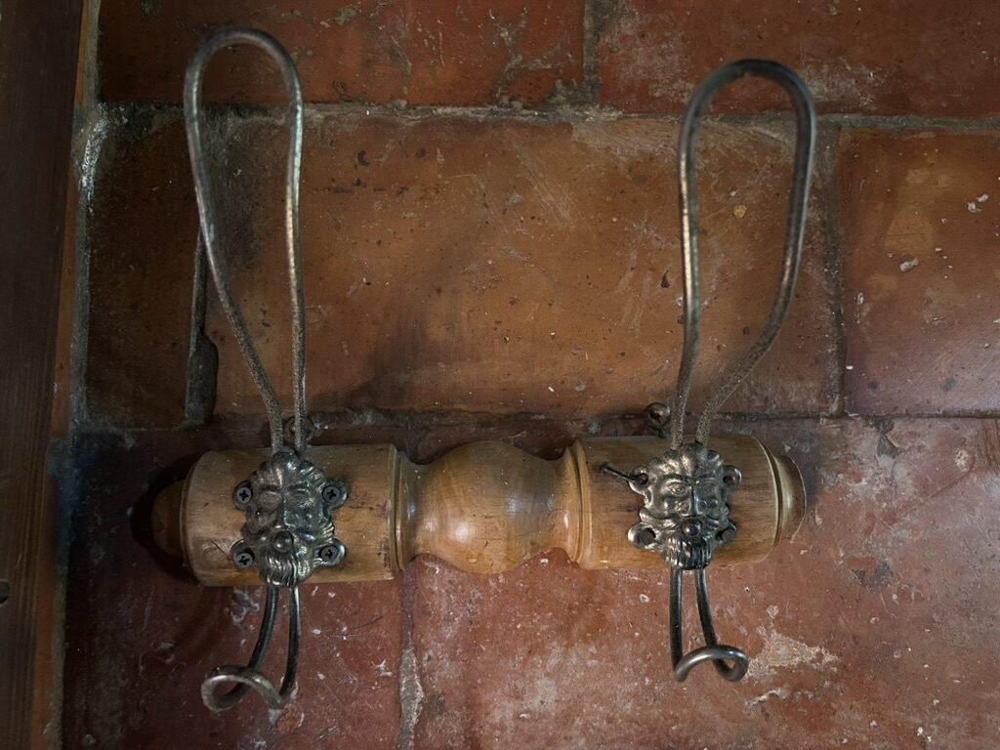

Lot MOB-065Accessoire de maison
<h2>Porte-manteau mural à deux crochets grotesques</h2>
Début XXe siècle

Estimation<strong>30 € – 70 €</strong>

</a></article><article class="catalog-card" data-location="À préciser" data-category="Luminaire"><a href="MOB-066/">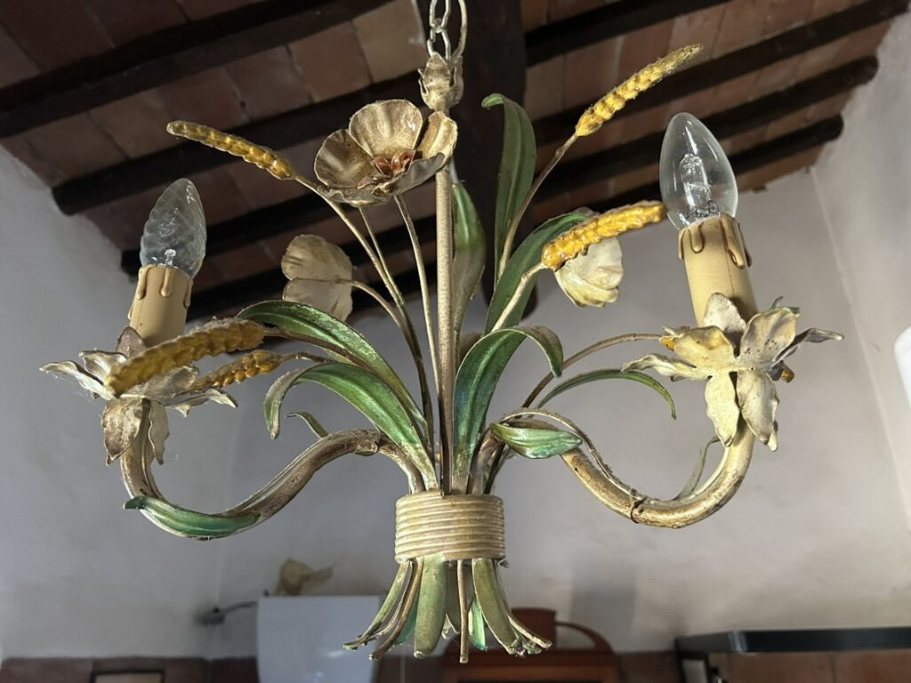

Lot MOB-066Luminaire
<h2>Lustre floral en métal peint à deux lumières</h2>
Vers 1950–1970

Estimation<strong>80 € – 180 €</strong>

</a></article><article class="catalog-card" data-location="À préciser" data-category="Meuble de rangement"><a href="MOB-067/">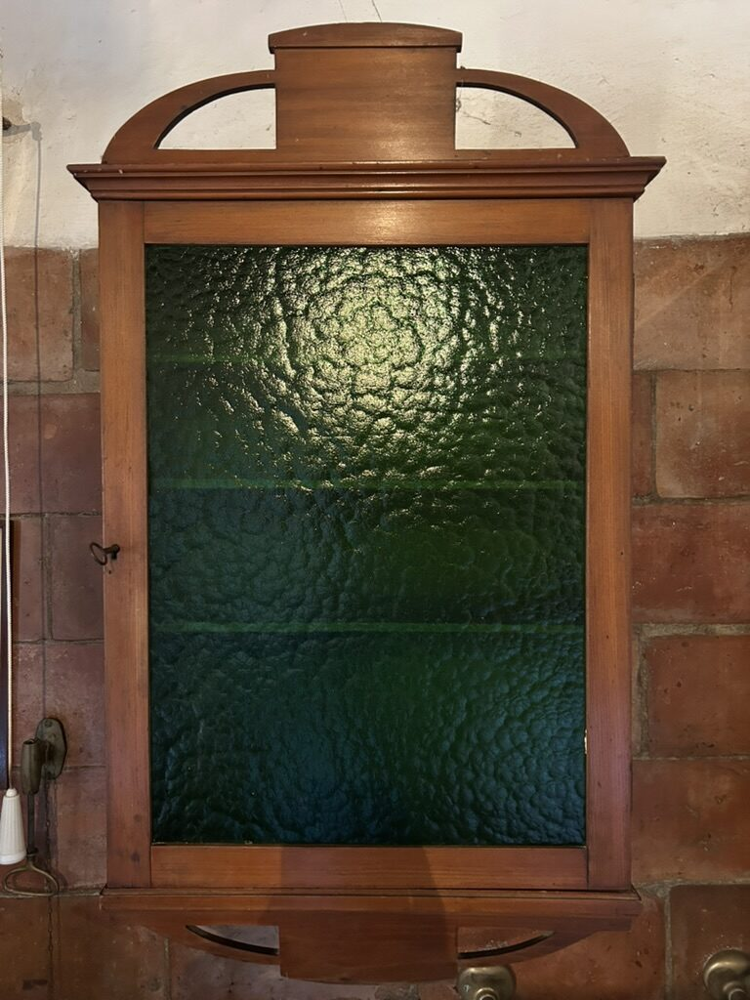

Lot MOB-067Meuble de rangement
<h2>Petit meuble mural à porte vitrée verte</h2>
Vers 1900–1930

Estimation<strong>80 € – 160 €</strong>

</a></article><article class="catalog-card" data-location="À préciser" data-category="Meuble de rangement"><a href="MOB-068/">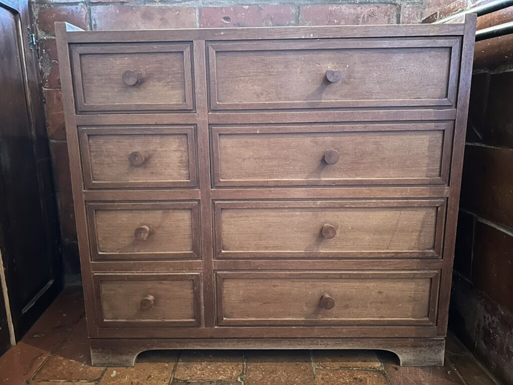

Lot MOB-068Meuble de rangement
<h2>Meuble bas à huit tiroirs</h2>
Milieu XXe siècle

Estimation<strong>80 € – 180 €</strong>

</a></article><article class="catalog-card" data-location="À préciser" data-category="Horlogerie"><a href="MOB-069/">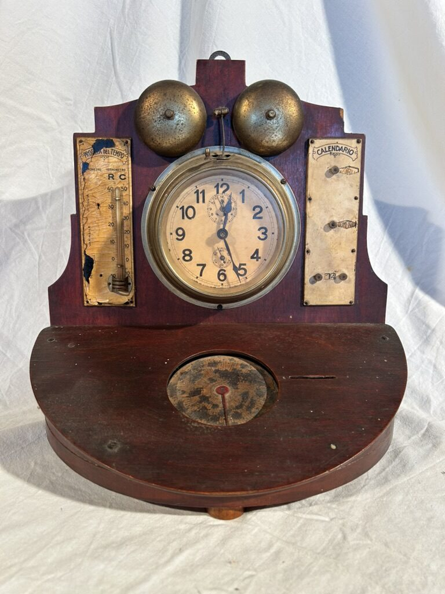

Lot MOB-069Horlogerie
<h2>Horloge-calendrier avec thermomètre et sonnerie</h2>
Vers 1930–1950

Estimation<strong>150 € – 350 €</strong>

</a></article><article class="catalog-card" data-location="À préciser" data-category="Luminaire"><a href="MOB-070/">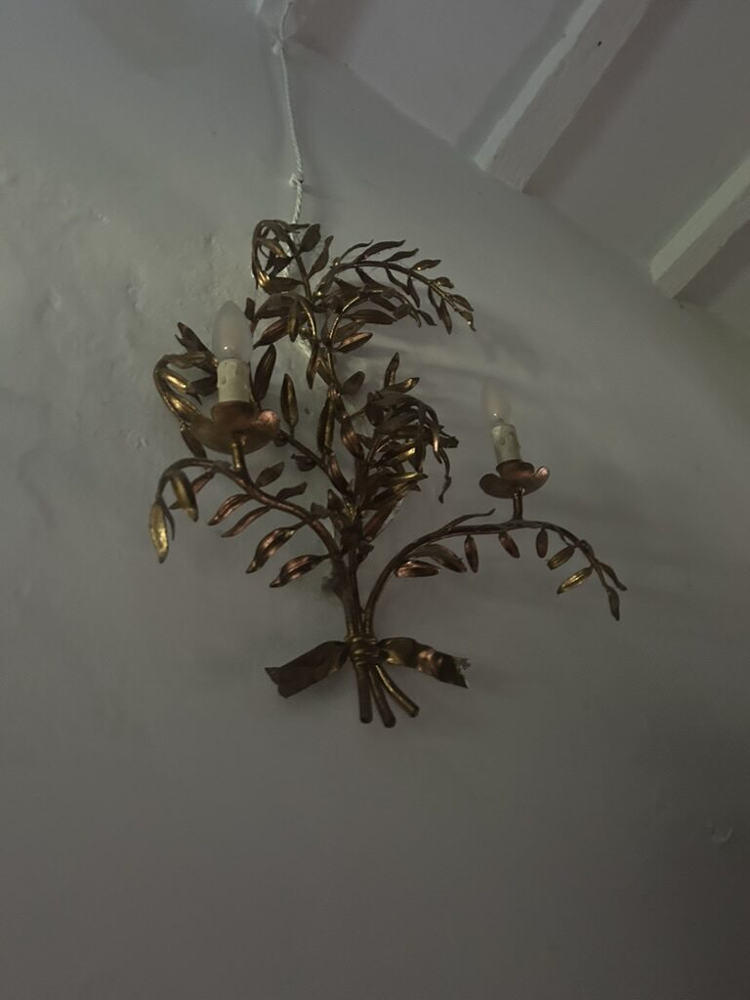

Lot MOB-070Luminaire
<h2>Lustre feuillagé en métal doré</h2>
Vers 1950–1970

Estimation<strong>80 € – 180 €</strong>

</a></article><article class="catalog-card" data-location="À préciser" data-category="Accessoire de maison"><a href="MOB-071/">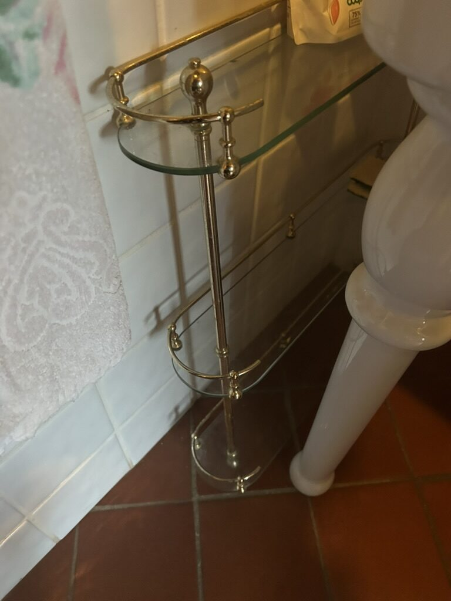

Lot MOB-071Accessoire de maison
<h2>Étagère de salle de bains en verre et métal</h2>
Vers 1940–1960

Estimation<strong>30 € – 70 €</strong>

</a></article><article class="catalog-card" data-location="À préciser" data-category="Instrument de musique"><a href="MOB-072/">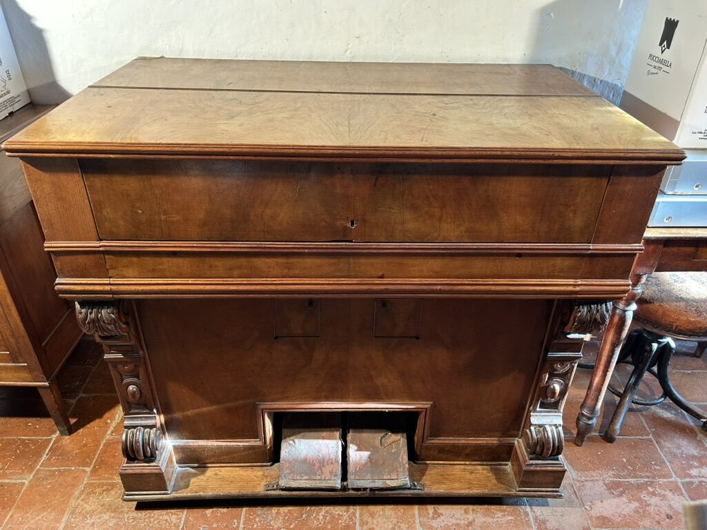

Lot MOB-072Instrument de musique
<h2>Harmonium à deux claviers Ph. J. Trayser &amp; Cie</h2>
Vers 1880–1910

Estimation<strong>250 € – 700 €</strong>

</a></article><article class="catalog-card" data-location="À préciser" data-category="Meuble de rangement"><a href="MOB-073/">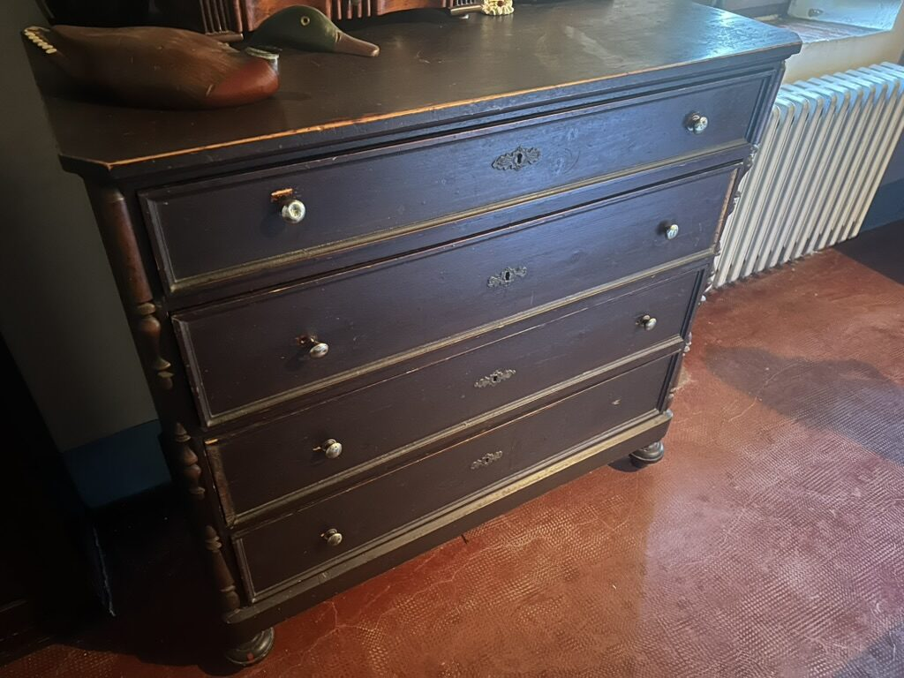

Lot MOB-073Meuble de rangement
<h2>Commode sombre à quatre tiroirs</h2>
XIXe siècle, remaniements possibles

Estimation<strong>120 € – 250 €</strong>

</a></article><article class="catalog-card" data-location="À préciser" data-category="Meuble de rangement"><a href="MOB-074/">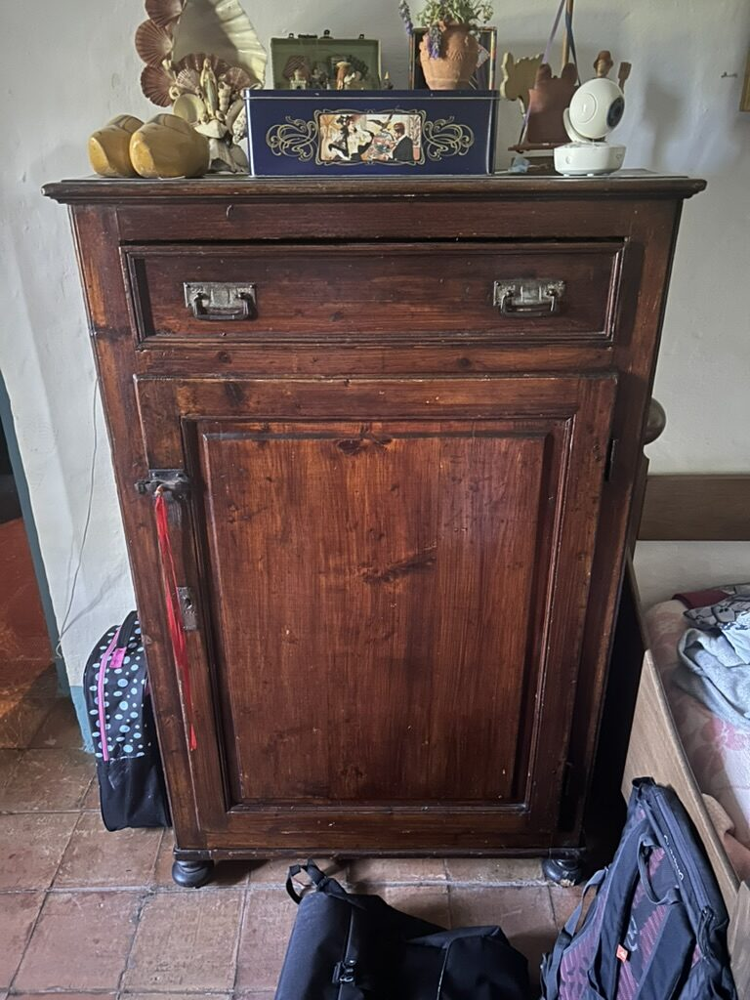

Lot MOB-074Meuble de rangement
<h2>Meuble haut à une porte et un tiroir</h2>
Fin XIXe–début XXe siècle

Estimation<strong>100 € – 220 €</strong>

</a></article><article class="catalog-card" data-location="À préciser" data-category="Meuble de rangement"><a href="MOB-075/">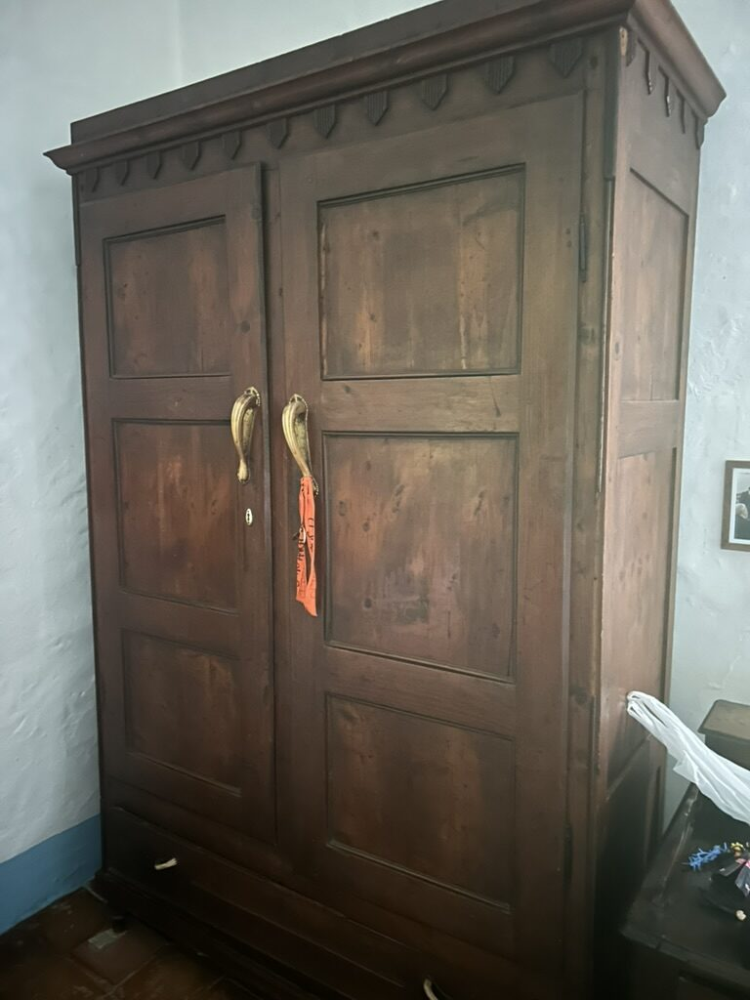

Lot MOB-075Meuble de rangement
<h2>Armoire à deux portes panneautées</h2>
XIXe siècle

Estimation<strong>200 € – 450 €</strong>

</a></article><article class="catalog-card" data-location="À préciser" data-category="Lit"><a href="MOB-076/">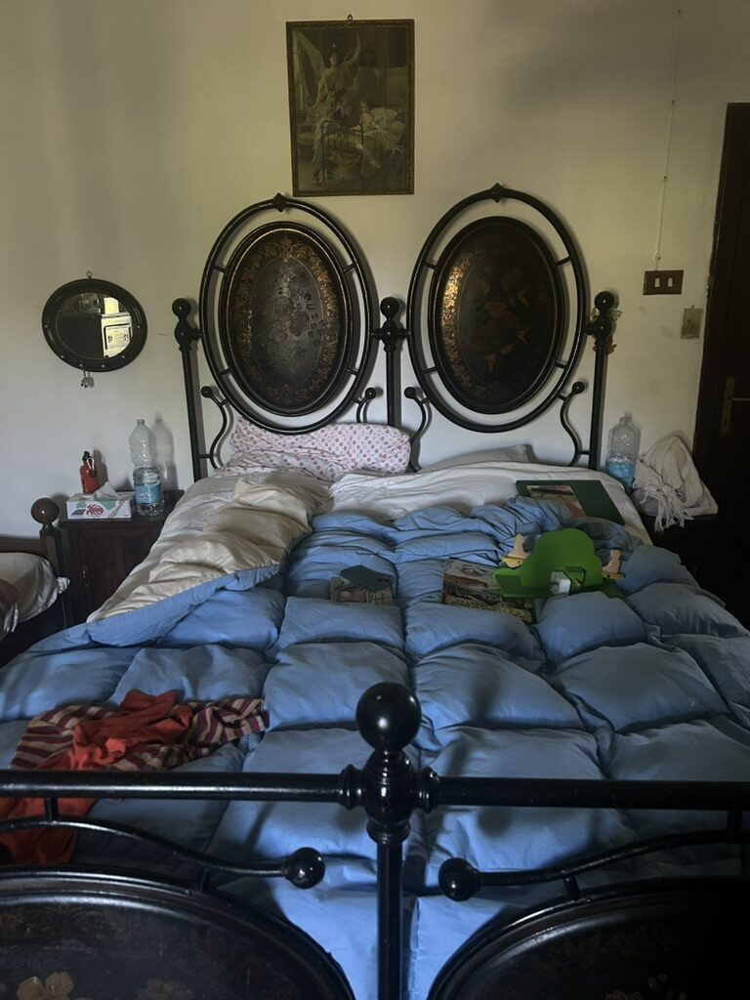

Lot MOB-076Lit
<h2>Lit double en métal à médaillons ovales</h2>
Fin XIXe–début XXe siècle

Estimation<strong>200 € – 500 €</strong>

</a></article><article class="catalog-card" data-location="À préciser" data-category="Meuble de rangement"><a href="MOB-077/">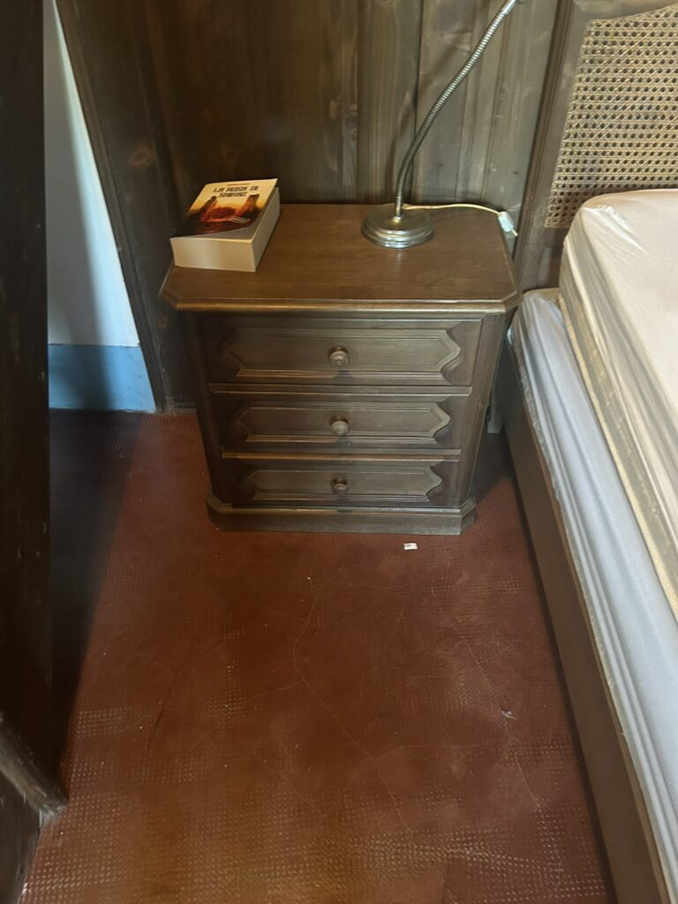

Lot MOB-077Meuble de rangement
<h2>Table de chevet à trois tiroirs</h2>
Vers 1960–1980

Estimation<strong>40 € – 80 €</strong>

</a></article><article class="catalog-card" data-location="À préciser" data-category="Meuble de rangement"><a href="MOB-078/">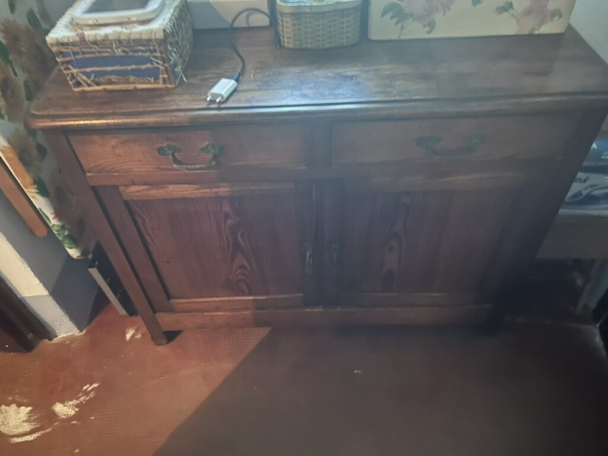

Lot MOB-078Meuble de rangement
<h2>Buffet bas à deux portes et deux tiroirs</h2>
XXe siècle

Estimation<strong>80 € – 180 €</strong>

</a></article><article class="catalog-card" data-location="À préciser" data-category="Mobilier de toilette"><a href="MOB-079/">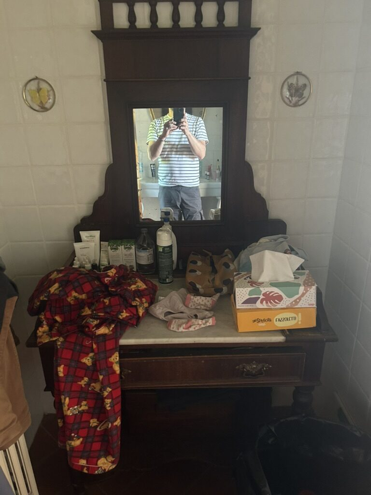

Lot MOB-079Mobilier de toilette
<h2>Meuble de toilette à miroir et plateau de marbre</h2>
Fin XIXe–début XXe siècle

Estimation<strong>100 € – 250 €</strong>

</a></article><article class="catalog-card" data-location="À préciser" data-category="Miroir"><a href="MOB-080/">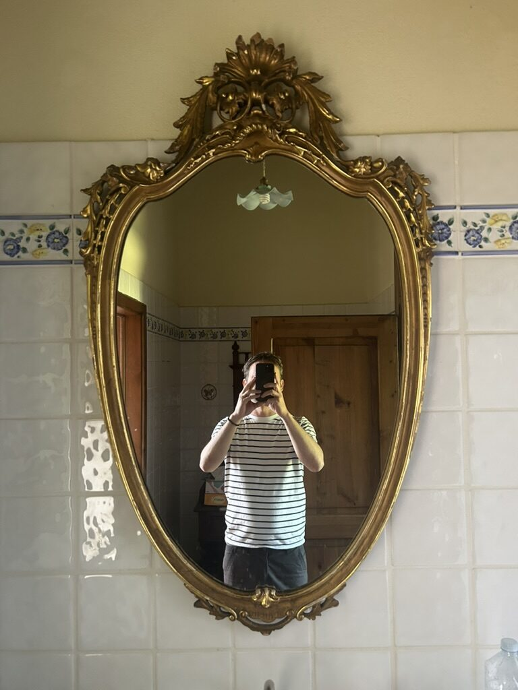

Lot MOB-080Miroir
<h2>Grand miroir doré de style rocaille</h2>
XXe siècle, style Louis XV

Estimation<strong>100 € – 250 €</strong>

</a></article><article class="catalog-card" data-location="À préciser" data-category="Siège"><a href="MOB-081/">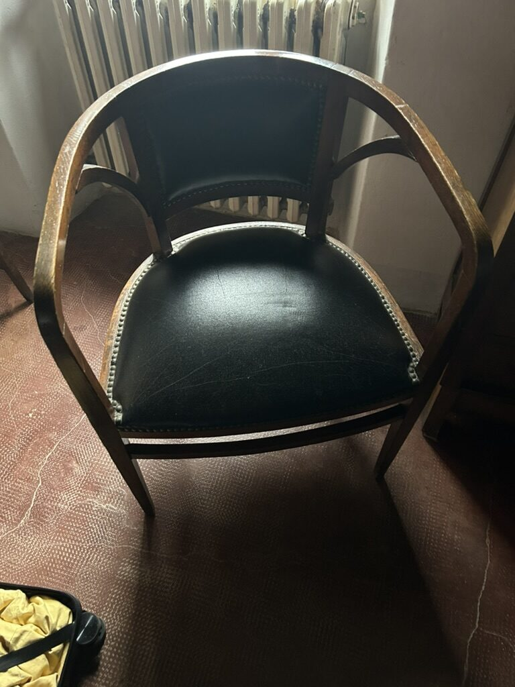

Lot MOB-081Siège
<h2>Fauteuil à dossier cintré et garniture noire</h2>
Vers 1920–1940, restauration postérieure possible

Estimation<strong>100 € – 250 €</strong>

</a></article><article class="catalog-card" data-location="À préciser" data-category="Luminaire"><a href="MOB-082/">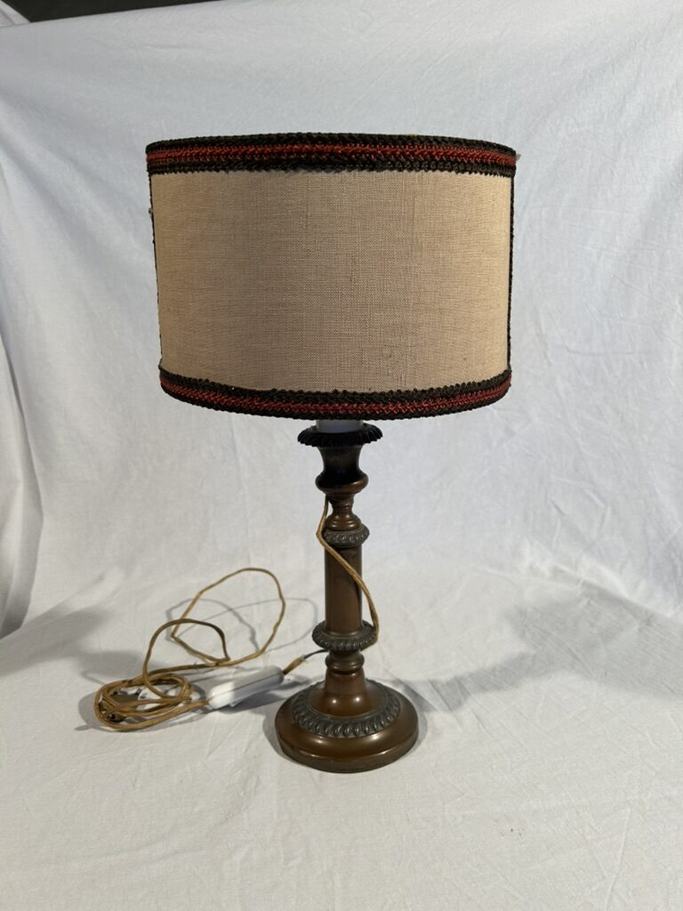

Lot MOB-082Luminaire
<h2>Lampe de table en métal patiné</h2>
Première moitié du XXe siècle, style historiciste

Estimation<strong>50 € – 120 €</strong>

</a></article><article class="catalog-card" data-location="À préciser" data-category="Arts de la table"><a href="MOB-083/">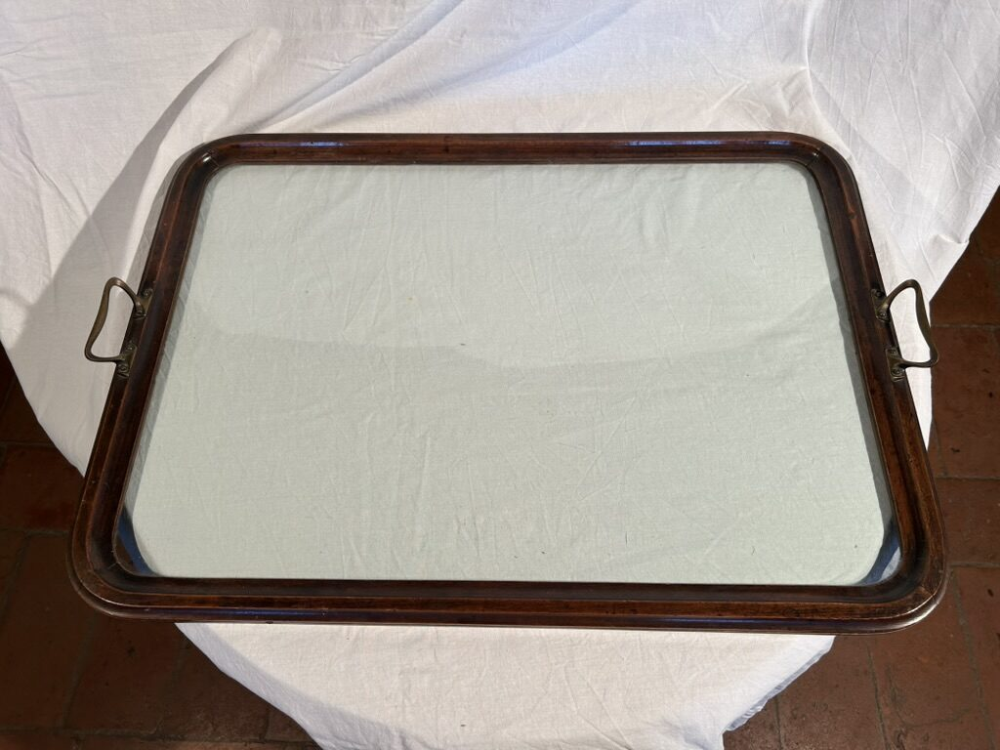

Lot MOB-083Arts de la table
<h2>Grand plateau de service vitré</h2>
Fin XIXe–début XXe siècle

Estimation<strong>60 € – 140 €</strong>

</a></article><article class="catalog-card" data-location="À préciser" data-category="Arts de la table"><a href="MOB-084/">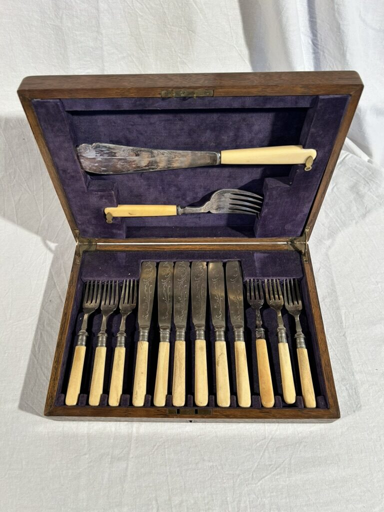

Lot MOB-084Arts de la table
<h2>Ménagère de couverts à manches clairs en coffret</h2>
Vers 1890–1920 · 15 items

Estimation<strong>1 200 € – 2 700 €</strong>

</a></article>

Aucun lot ne correspond à ces critères.

