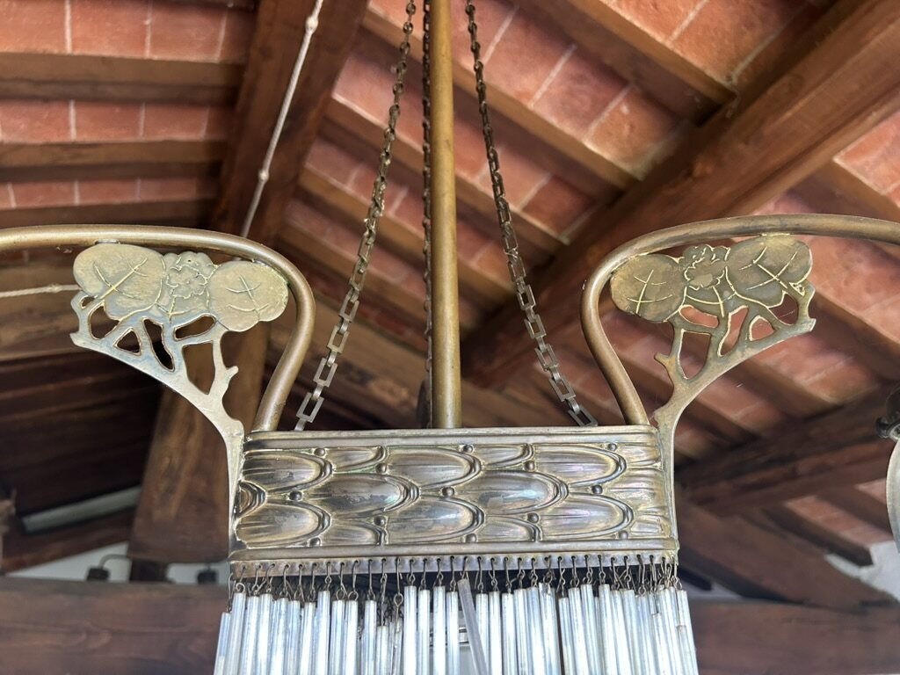

<header class="home-intro">
  
Collection particulière · Toscane

  <h1>Emeleta</h1>
  
Trequanda, SI

</header>

  <article class="collection-portal collection-portal-library">
    
    

      
Livres anciens

      <h2>Bibliothèque</h2>
      
Un futur inventaire consacré aux ouvrages anciens, à leurs provenances et à leurs singularités.

      <a class="collection-portal-link" href="bibliotheque/">Consulter la bibliothèque →</a>
    

  </article>

  <article class="collection-portal collection-portal-furniture">
    

      
>

    

    

      
Mobilier & objets d’art

      <h2>Inventaire</h2>
      
Un catalogue évolutif consacré au mobilier et aux témoins matériels conservés dans la maison.

      <a class="collection-portal-link" href="catalogue/">Consulter le catalogue →</a>
    

  </article>

