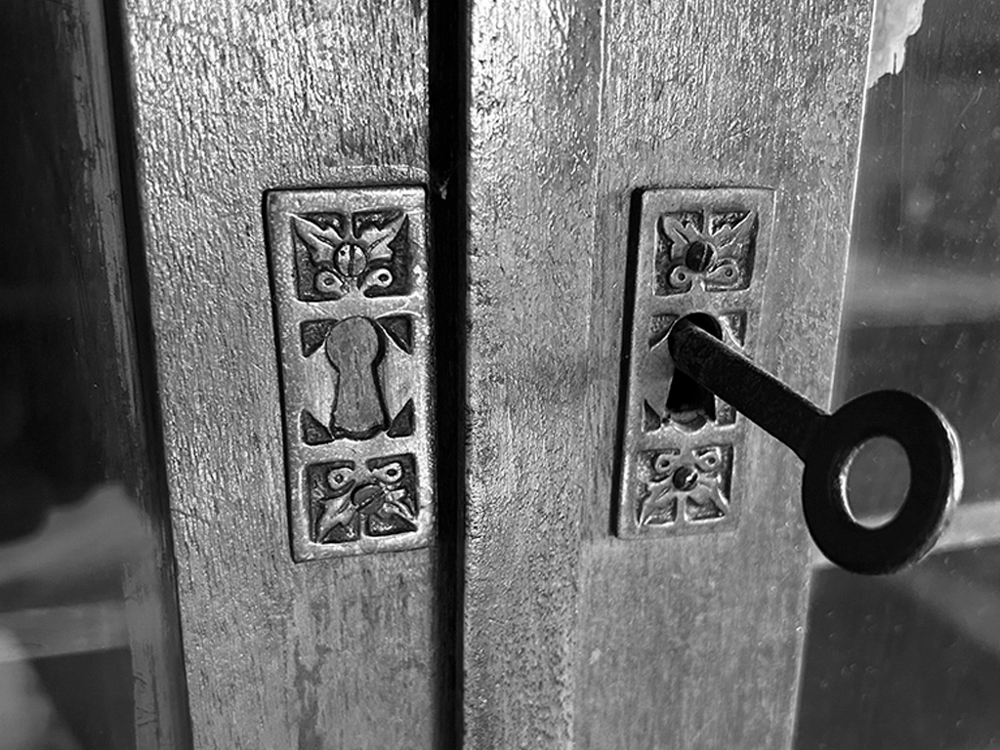
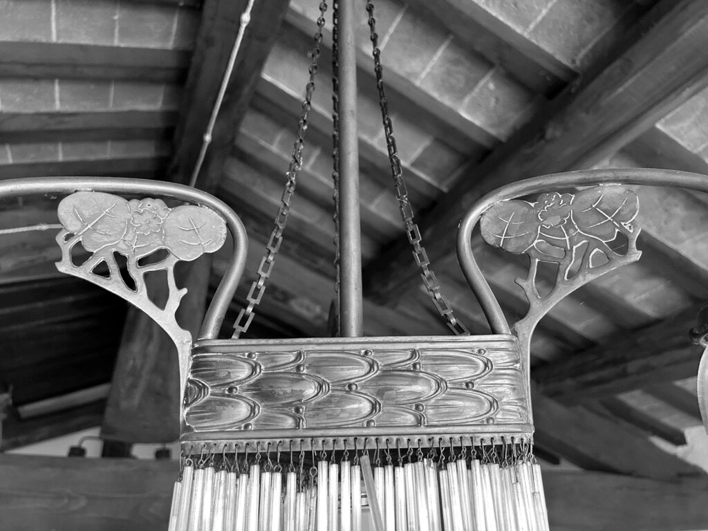

<header class="home-intro">
  <h1>Trinketa</h1>
  
<em>by</em> Baboulinet

</header>

  <article class="collection-portal collection-portal-library">
    
    

      
Libri

      <h2>Biblioteca</h2>
      
Un futuro inventario dedicato ai libri antichi, alle loro provenienze e alle loro particolarità.

      <a class="collection-portal-link" href="bibliotheque/">Consulta →</a>
    

  </article>

  <article class="collection-portal collection-portal-furniture">
    
    

      
Arredi e oggetti d’arte

      <h2>Inventario</h2>
      
Un inventario in evoluzione dedicato agli arredi e alle testimonianze materiali conservate nella casa.

      <a class="collection-portal-link" href="inventaire/">Consulta→</a>
    

  </article>

